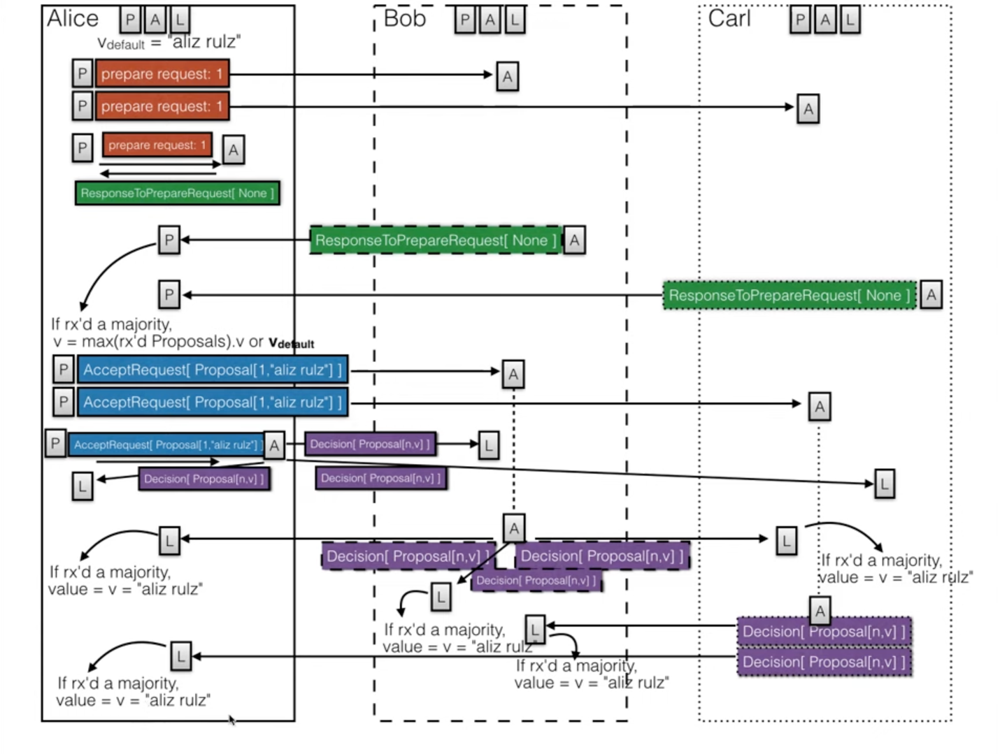

## PaxMesh — Transport-Agnostic RPC Framework with PAXOS

PaxMesh is a compact, transport-agnostic RPC and consensus showcase. It implements PAXOS algorithm in Lamport's [*PAXOS Made Simple*](https://lamport.azurewebsites.net/pubs/paxos-simple.pdf) to coordinate state updates across a small cluster, while abstracting networking behind pluggable transports (Java RMI, Vert.x, etc.), pluggable serialization, and a simple registry. The embedded KV store serves as the state machine to visualize agreement; the emphasis is on end-to-end RPC wiring, PAXOS message flow, and replica convergence under failure.

